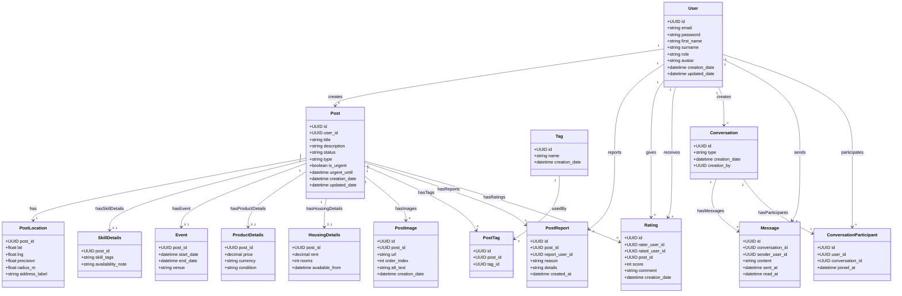

```mermaid
classDiagram

%% =========================
%% Classes
%% =========================

    class User {
        +UUID id
        +string email
        +string password
        +string first_name
        +string surname
        +string role
        +string avatar
        +datetime creation_date
        +datetime updated_date
    }

    class Post {
        +UUID id
        +UUID user_id
        +string title
        +string description
        +string status
        +string type
        +boolean is_urgent
        +datetime urgent_until
        +datetime creation_date
        +datetime updated_date
    }

    class PostLocation {
        +UUID post_id
        +float lat
        +float lng
        +float precision
        +float radius_m
        +string address_label
    }

    class Tag {
        +UUID id
        +string name
        +datetime creation_date
    }

    class PostTag {
        +UUID id
        +UUID post_id
        +UUID tag_id
    }

    class PostImage {
        +UUID id
        +UUID post_id
        +string url
        +int order_index
        +string alt_text
        +datetime creation_date
    }

    class SkillDetails {
        +UUID post_id
        +string skill_tags
        +string availability_note
    }

    class Event {
        +UUID post_id
        +datetime start_date
        +datetime end_date
        +string venue
    }

    class ProductDetails {
        +UUID post_id
        +decimal price
        +string currency
        +string condition
    }

    class HousingDetails {
        +UUID post_id
        +decimal rent
        +int rooms
        +datetime available_from
    }

    class Rating {
        +UUID id
        +UUID rater_user_id
        +UUID rated_user_id
        +UUID post_id
        +int score
        +string comment
        +datetime creation_date
    }

    class PostReport {
        +UUID id
        +UUID post_id
        +UUID report_user_id
        +string reason
        +string details
        +datetime created_at
    }

    class Conversation {
        +UUID id
        +string type
        +datetime creation_date
        +UUID creation_by
    }

    class Message {
        +UUID id
        +UUID conversation_id
        +UUID sender_user_id
        +string content
        +datetime sent_at
        +datetime read_at
    }

    class ConversationParticipant {
        +UUID id
        +UUID user_id
        +UUID conversation_id
        +datetime joined_at
    }

%% =========================
%% Relationships (from ERD)
%% =========================

    User "1" --> "n" Post : creates
    Post "1" --> "1" PostLocation : has
    Post "1" --> "0..1" SkillDetails : hasSkillDetails
    Post "1" --> "0..1" Event : hasEvent
    Post "1" --> "0..1" ProductDetails : hasProductDetails
    Post "1" --> "0..1" HousingDetails : hasHousingDetails
    Post "1" --> "n" PostImage : hasImages
    Post "1" --> "n" PostTag : hasTags
    Tag "1" --> "n" PostTag : usedBy
    User "1" --> "n" PostReport : reports
    Post "1" --> "n" PostReport : hasReports
    User "1" --> "n" Rating : gives
    User "1" --> "n" Rating : receives
    Post "1" --> "n" Rating : hasRatings
    User "1" --> "n" Conversation : creates
    Conversation "1" --> "n" Message : hasMessages
    User "1" --> "n" Message : sends
    Conversation "1" --> "n" ConversationParticipant : hasParticipants
    User "1" --> "n" ConversationParticipant : participates
```
